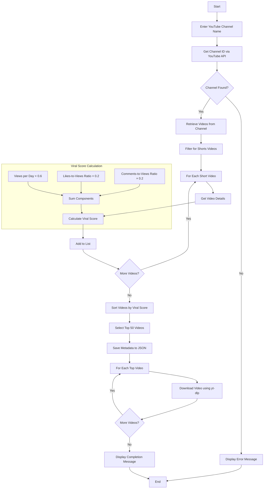

# YouTube Shorts Viral Analysis Flowchart

## Process Description

1. **Input**: User enters a YouTube channel name
2. **Channel Identification**: System retrieves the channel ID using YouTube API
3. **Video Collection**: System fetches all videos from the channel
4. **Shorts Filtering**: Only videos under 60 seconds are considered Shorts
5. **Metrics Analysis**: For each Short, the system collects:
   - View count
   - Like count
   - Comment count
   - Upload date
   - Duration
6. **Viral Score Calculation**: Each video receives a score based on:
   - Views per day (60% weight)
   - Like-to-view ratio (20% weight)
   - Comment-to-view ratio (20% weight)
7. **Ranking**: Videos are sorted by viral score
8. **Selection**: Top 50 videos are selected
9. **Metadata Storage**: Video details are saved to a JSON file
10. **Download**: Selected videos are downloaded using yt-dlp
11. **Completion**: User is notified when the process is complete